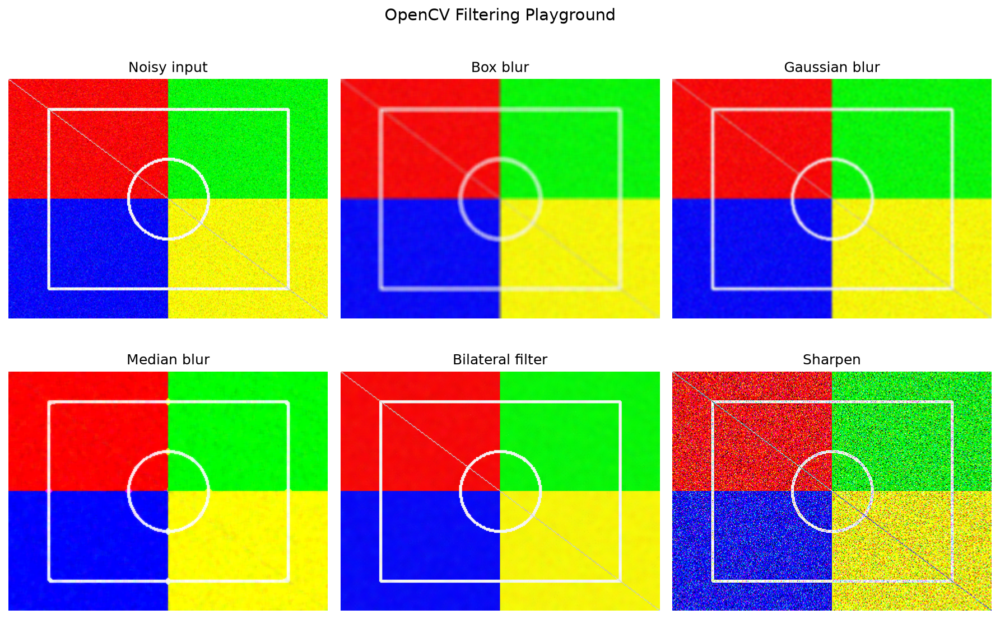

# OpenCV Filtering Playground

OpenCV utilities for **box blur**, **Gaussian**, **median**, **bilateral**, and **sharpening** — PBOS Sprint 1, Day 4.

[](requirements.txt)
[](https://opencv.org/)
[](LICENSE)

---

## One-Line Description

Compare five OpenCV filters side-by-side on noisy images — blur, denoise, edge-preserving smoothing, and sharpen.

---

## Problem

After loading (Day 2) and transforming (Day 3) images, the next step is **noise reduction and enhancement**:

1. Box blur — fast averaging  
2. Gaussian blur — weighted smoothing  
3. Median blur — salt-and-pepper removal  
4. Bilateral filter — smooth while keeping edges  
5. Sharpen — enhance detail after denoising  

This repo implements all five with a visual comparison grid.

---

## Features

- **Box blur** — `cv2.blur` average filter  
- **Gaussian blur** — `cv2.GaussianBlur` with configurable sigma  
- **Median blur** — robust to impulse noise  
- **Bilateral filter** — edge-preserving denoise  
- **Sharpen** — 3×3 Laplacian-style kernel  
- Synthetic noisy demo pattern — runs without external images  
- 2×3 matplotlib grid for documentation  
- Unit tests with `pytest`

---

## Installation

```bash
git clone https://github.com/ssk525/opencv-filtering-playground.git
cd opencv-filtering-playground
python3 -m venv .venv
source .venv/bin/activate   # Windows: .venv\Scripts\activate
pip install -r requirements.txt
```

---

## Usage

### Demo (no input file)

```bash
python main.py --demo
```

Output: `output/filters.png`

### Your own image

```bash
python main.py --input path/to/image.jpg --noise 30 --output output/my_grid.png
```

### Python API

```python
from image_filters import (
    load_image,
    add_gaussian_noise,
    apply_gaussian_blur,
    apply_median_blur,
    apply_bilateral,
    apply_sharpen,
    save_filter_grid,
)

image = load_image("photo.jpg")
noisy = add_gaussian_noise(image, sigma=25)
smooth = apply_bilateral(noisy)
sharp = apply_sharpen(smooth)
save_filter_grid(noisy, "output/grid.png")
```

---

## Sample Output



*Noisy input vs box, Gaussian, median, bilateral, and sharpen.*

---

## Project Structure

```
opencv-filtering-playground/
├── main.py
├── src/image_filters/
│   ├── loader.py
│   ├── filters.py
│   └── display.py
├── tests/
├── assets/filters.png
└── requirements.txt
```

---

## Filter Cheat Sheet

| Filter | Best for | Trade-off |
|:-------|:---------|:----------|
| **Box blur** | Fast smoothing | Blurs edges heavily |
| **Gaussian** | General noise reduction | Softer than box, still blurs edges |
| **Median** | Salt-and-pepper noise | Slower; good for impulse noise |
| **Bilateral** | Edge-preserving denoise | Slower; best when edges matter |
| **Sharpen** | Recover detail | Amplifies noise if used alone |

---

## Interview Questions

1. What is the difference between Gaussian and median filtering?
2. Why does bilateral filtering preserve edges better than Gaussian blur?
3. When would box blur be preferred over Gaussian?
4. Why must median/Gaussian kernel sizes be odd?
5. Should you sharpen before or after denoising?

---

## Related (PBOS Sprint 1)

| Day | Repo | Topic |
|:----|:-----|:------|
| 2 | [python-image-basics](https://github.com/ssk525/python-image-basics) | Loading & color |
| 3 | [opencv-image-transformations](https://github.com/ssk525/opencv-image-transformations) | Geometry |
| 4 | **opencv-filtering-playground** (this) | Filters |
| 5 | opencv-edge-detection | Canny, Sobel |

---

## Author

**Saswat Suvam Kumar** — M.Tech NIT Rourkela · Project Engineer @ DRDO

[](https://github.com/ssk525)
[](https://www.linkedin.com/in/saswat-suvam-kumar-8b3581208)

---

## License

MIT © 2026 Saswat Suvam Kumar
